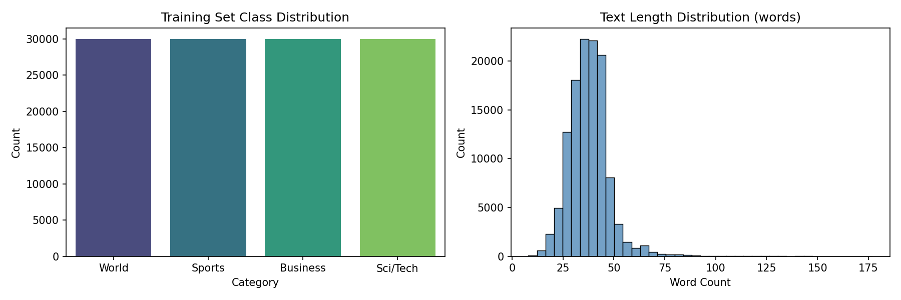
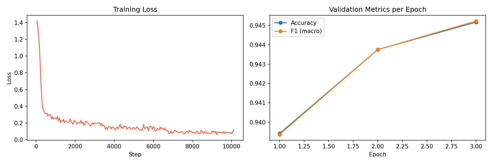
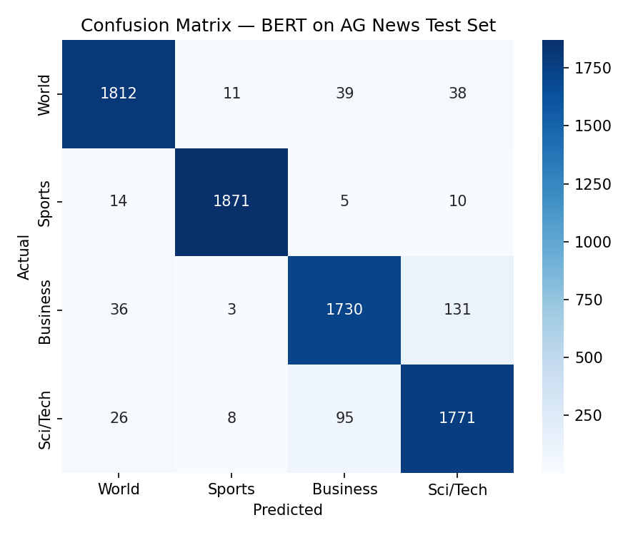

# News Topic Classifier — BERT Fine-Tuning on AG News

Fine-tunes `bert-base-uncased` to classify news headlines into four topic categories
(**World, Sports, Business, Sci/Tech**) using the AG News dataset, deployed as an
interactive Streamlit app for live predictions.

## Objective

Build a transformer-based text classifier that automatically routes news headlines into
topical categories, demonstrating:
- Transfer learning with a pretrained BERT encoder
- Proper preprocessing/tokenization for short-text classification
- Rigorous multi-class evaluation (accuracy, precision, recall, F1)
- Lightweight deployment for real-time interaction

## Dataset

[AG News](https://huggingface.co/spaces/datasets-topics/fancyzhx-ag_news) | 120,000 training and 7,600 test
examples, evenly split across 4 balanced classes:

| Label | Category |
|---|---|
| 0 | World |
| 1 | Sports |
| 2 | Business |
| 3 | Sci/Tech |

## Methodology

1. **Preprocessing** : loaded via 🤗 `datasets`, tokenized with `BertTokenizerFast`
   (`max_length=64`, dynamic padding via `DataCollatorWithPadding`); a stratified 10% of
   the training set (12,000 examples) is held out for validation.
2. **Model** : `bert-base-uncased` + classification head
   (`BertForSequenceClassification`, `num_labels=4`, 109.5M trainable parameters).
3. **Training** : Hugging Face `Trainer`, 3 epochs, `lr=2e-5`, batch size 32, 10% linear
   warmup, weight decay 0.01, mixed precision (fp16) on GPU, best checkpoint selected by
   validation macro-F1.
4. **Evaluation** : accuracy, precision/recall/F1 (macro & weighted), confusion matrix,
   and a full classification report on the held-out AG News test set (7,600 examples).
5. **Deployment** : a Streamlit app (`app.py`) loads the saved fine-tuned checkpoint and
   classifies user-entered text in real time with per-class confidence bars.

## Key Results

Measured on the held-out AG News test set (7,600 examples, 1,900 per class):

| Metric | Score |
|---|---|
| Test Accuracy | **94.53%** |
| Macro F1 | **94.53%** |
| Weighted F1 | **94.53%** |
| Macro Precision | 94.55% |
| Macro Recall | 94.53% |
| Test Loss | 0.2026 |

**Per-class breakdown:**

| Class | Precision | Recall | F1-score | Support |
|---|---|---|---|---|
| World | 95.97% | 95.37% | 95.67% | 1,900 |
| Sports | 98.84% | 98.47% | 98.66% | 1,900 |
| Business | 92.56% | 91.05% | 91.80% | 1,900 |
| Sci/Tech | 90.82% | 93.21% | 92.00% | 1,900 |

## Visualizations

**Class distribution & text length (EDA):**



**Training loss and validation metrics per epoch:**



**Confusion matrix on the test set:**



## Example Predictions

Live inference from the deployed model:

| Headline | Predicted Category | Confidence |
|---|---|---|
| "Federal Reserve raises interest rates amid inflation concerns" | Business | 98.22% |
| "Manchester United secures dramatic last-minute victory" | World | 95.71% |
| "NASA telescope captures stunning new images of distant galaxy" | Sci/Tech | 99.24% |
| "United Nations calls for ceasefire amid escalating conflict" | World | 99.79% |

**Observations**
- Accuracy and macro-F1 are identical (94.53%) because the AG News test set is perfectly
  balanced (1,900 examples per class), so macro and weighted averages coincide.
- **Sports is the strongest class by far** (98.66% F1) — sports headlines use distinctive,
  low-ambiguity vocabulary that the model separates cleanly from the other three topics.
- **Business and Sci/Tech are the weakest classes** (91.80% and 92.00% F1 respectively),
  confirming the expected overlap between the two: Business's recall (91.05%) is its
  weakest metric, meaning some genuine Business headlines get pulled into Sci/Tech, while
  Sci/Tech's precision (90.82%) is its weakest metric, meaning it also picks up some
  headlines that are really Business news — consistent with real-world topical overlap
  (tech-company earnings, product launches, market coverage of tech stocks).
- World sits comfortably in between (95.67% F1), reflecting its broad but distinct subject
  matter relative to the other three.
- Dynamic padding (`DataCollatorWithPadding`) reduced wasted compute versus fixed-length
  padding, since AG News examples vary in length (median 37 words).


## Repository Structure

```
.
├── News_Topic_Classifier_BERT.ipynb   # full pipeline: data -> training -> evaluation -> visualizations
├── app.py                             # Streamlit app for live inference
├── requirements.txt
├── README.md
├── eda_overview.png                   # class distribution & text length (generated by the notebook)
├── training_curves.png                # training loss & validation metrics per epoch
└── confusion_matrix.png               # test-set confusion matrix
```

*(`eda_overview.png`, `training_curves.png`, and `confusion_matrix.png` are produced by
running the notebook, re-running it will regenerate and overwrite them. The fine-tuned
  model itself is saved to `./bert-ag-news/final/`, which is excluded from version control
  due to its size — see `.gitignore` recommendations below.)*

> **Tip:** add a `.gitignore` entry for `bert-ag-news/` before pushing to GitHub — the
> fine-tuned checkpoint includes a ~440MB `model.safetensors` file that doesn't belong in
> a git repo. Host it on the Hugging Face Hub or a release asset instead if you want to
> share the weights.

## How to Run

**1. Train the model** (Google Colab with a GPU runtime is recommended):

```bash
pip install -r requirements.txt
jupyter notebook News_Topic_Classifier_BERT.ipynb
```

Running the notebook end-to-end saves the fine-tuned model to `./bert-ag-news/final/`.

**2. Launch the live demo:**

```bash
streamlit run app.py
```

Enter any news headline and the app returns the predicted category with a confidence
breakdown across all four classes.

## Skills Demonstrated

- NLP with Hugging Face Transformers
- Transfer learning & fine-tuning of a pretrained BERT model
- Evaluation metrics for multi-class text classification (accuracy, F1, confusion matrix)
- Lightweight model deployment with Streamlit
