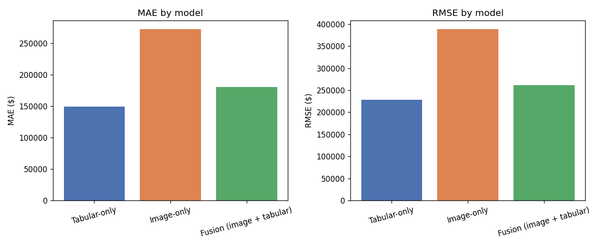
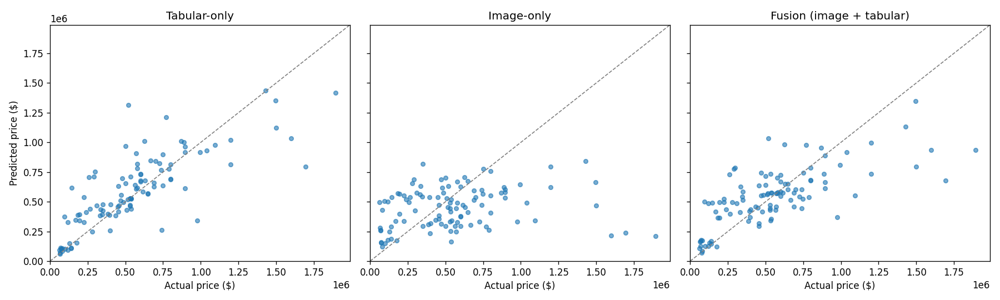

# Multimodal Housing Price Prediction (CNN + Tabular Fusion)

Predicting house prices using both structured data (bedrooms, bathrooms, square footage, zip code)
and photos of the house (bedroom, bathroom, kitchen, frontal exterior), and more importantly,checking whether combining the two beats using either one alone.

## Objective

Build a model that fuses CNN-extracted image features with tabular features to predict housing
price, and evaluate it against single-modality baselines using MAE and RMSE.

## Dataset

[Houses Dataset (Ahmed & Moataz, 2016)](https://github.com/emanhamed/Houses-dataset): 535 houses
with 4 photos each (bedroom / bathroom / kitchen / frontal) and a tabular record (bedrooms,
bathrooms, area, zip code, price). This is the standard public benchmark for image+tabular housing
price regression.

**To reproduce this notebook:** clone the dataset into `data/` so the structure looks like:

```
data/
└── Houses Dataset/
    ├── HousesInfo.txt
    ├── 1_bedroom.jpg
    ├── 1_bathroom.jpg
    ├── 1_kitchen.jpg
    ├── 1_frontal.jpg
    └── ... (2,140 images total)
```

```bash
git clone https://github.com/emanhamed/Houses-dataset.git data/Houses-dataset-tmp
mv "data/Houses-dataset-tmp/Houses Dataset" "data/Houses Dataset"
rm -rf data/Houses-dataset-tmp
```

## Methodology

1. **Tabular preprocessing**: min-max scale bedrooms/bathrooms/area; bucket zip codes with fewer
   than 20 houses into an "other" category, then one-hot encode.
2. **Image preprocessing**: tile each house's 4 room photos into a single 64x64 montage image
   (2x2 grid of 32x32 tiles), rather than running 4 separate CNN towers per house. With only 535
   houses, 4 towers would multiply parameter count for no real benefit.
3. **Target transform**: train on standardized `log1p(price)` (raw price is heavily right-skewed;
   log-transforming flattens that out, and standardizing keeps the network from wasting early
   epochs walking the output bias up to the right scale). Predictions are inverse-transformed back
   to dollars before computing metrics.
4. **Three models, trained and compared fairly:**
   - **Tabular-only**: small MLP on structured features.
   - **Image-only**: small CNN (3 conv blocks) on the montage image.
   - **Fusion**: both branches in parallel, feature vectors concatenated, then a couple of dense
     layers regress to price.
5. **Evaluation**: MAE and RMSE in actual dollars, on a held-out 20% test split (107 houses).

See [`notebook/multimodal_housing_price_prediction.ipynb`](notebook/multimodal_housing_price_prediction.ipynb)
for the full, executed pipeline, code, plots, and outputs included.

## Key results

| Model | MAE | RMSE |
|---|---|---|
| Tabular-only | $149,683 | $228,619 |
| Image-only | $272,664 | $388,596 |
| **Fusion (image + tabular)** | $180,482 | $261,171 |




**Observations:**

- Tabular data alone is the strongest single input by a clear margin, square footage, room
  counts, and zip code are exactly the low-noise features a real estate appraiser would lean on.
- The image-only CNN, trained from scratch, is the weakest model. 535 houses isn't enough data
  to learn robust visual "expensive-looking house" features without a pretrained backbone, and
photos carry staging/photography variance that has nothing to do with price.
- **Fusion underperforms the tabular-only baseline in this run.** That's a real result worth
  reporting honestly, not a bug to hide: concatenating a noisy image-feature vector onto strong
  tabular features can hurt as much as help, if the image branch isn't carrying real signal.
  Multimodal fusion only pays off when every modality it combines is actually pulling weight,
  it isn't automatically better just because it uses more data sources.
- The most promising next step is **transfer learning**, swapping the from-scratch CNN for a
  pretrained ImageNet backbone (ResNet50 / MobileNetV2) would very likely close this gap, since
  the image branch wouldn't have to learn generic visual features from just 535 examples.

## Repo structure

```
.
├── README.md
├── requirements.txt
├── data/                    # put the downloaded dataset here (gitignored)
├── notebook/
│   └── multimodal_housing_price_prediction.ipynb
└── outputs/                 # saved plots referenced above
```

## Setup

```bash
pip install -r requirements.txt
jupyter notebook notebook/multimodal_housing_price_prediction.ipynb
```

